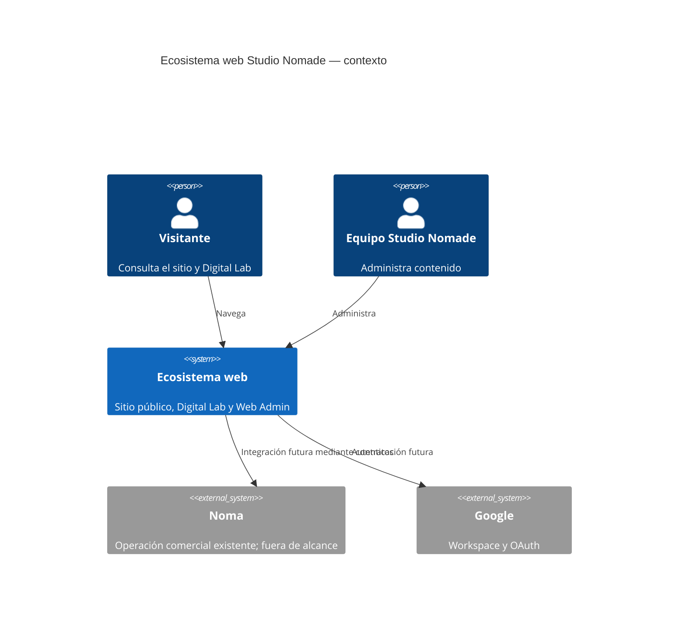
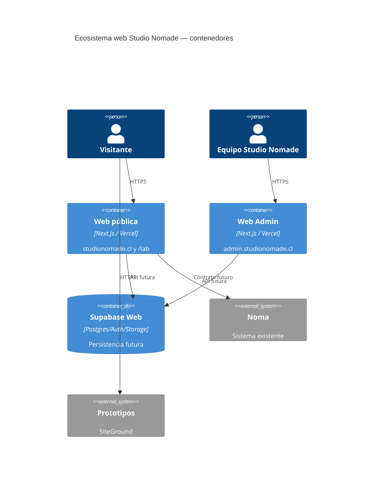

# Arquitectura C4 inicial

## Nivel 1 — Contexto

Noma se representa como sistema externo: M00 no lo crea, configura ni modifica.

## Nivel 2 — Contenedores

Las relaciones con Supabase y Noma son objetivos futuros, no implementaciones de M00.
