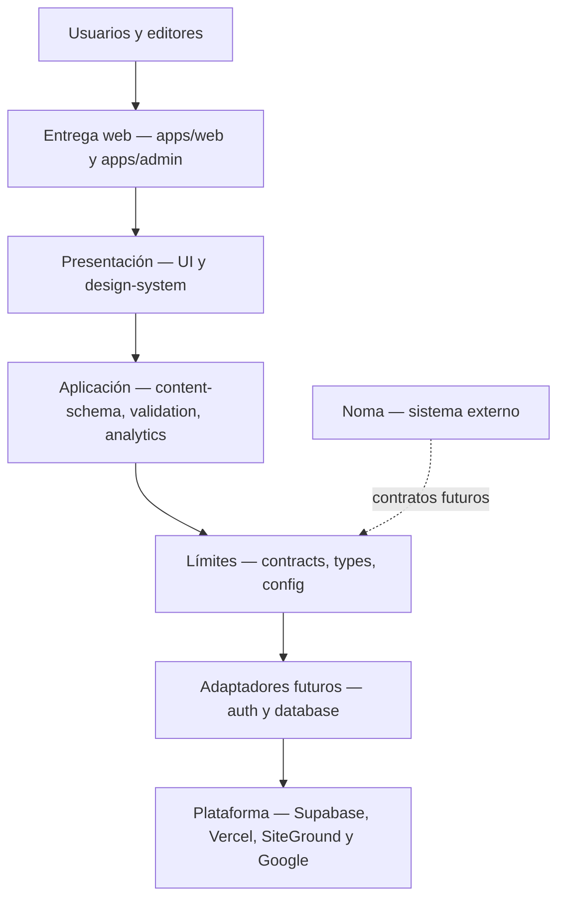

# Diagrama de capas

## Reglas de dependencia

- Las aplicaciones pueden consumir paquetes públicos del monorepo.
- Los límites compartidos no dependen de aplicaciones ni del repositorio privado.
- `auth` y `database` son placeholders; no contienen conexiones ni políticas en M00.
- La infraestructura entrega y persiste, pero no define reglas comerciales.
