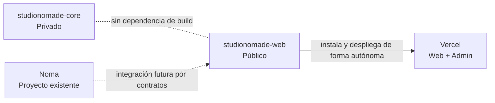

# Diagrama de repositorios

`studionomade-web` debe instalarse, probarse y desplegarse sin clonar `studionomade-core`. El repositorio público no almacena know-how, reglas comerciales ni secretos. Noma permanece fuera de este repositorio.
