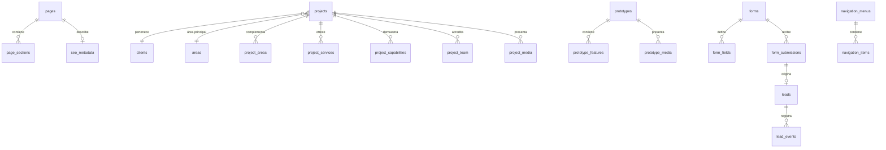

# Esquema Supabase Web — M03

Este esquema pertenece exclusivamente al ecosistema web. No comparte tablas ni conexiones con Noma.

## Modelo MVP

Las 37 tablas MVP enumeradas por M03 se crean en cinco migraciones ordenadas por catálogos, contenido, proyectos,
leads y sistema/seguridad. Las entidades diferidas de fase 2 no están presentes.

## RLS

Todas las tablas tienen RLS habilitada y forzada. La ausencia de una política equivale a denegación.
El rol `anon` solo recibe políticas `select` explícitas para filas publicadas o catálogos activos; no
existe ninguna política de escritura en M03. Por ejemplo, `pages` solo es visible cuando
`status = 'publicado'`, y `page_sections` comprueba además que su página padre esté publicada.
M04 añadirá autorización de escritura para usuarios autenticados.

## Storage

| Bucket              | Público | Máximo | MIME permitidos                  |
| ------------------- | ------- | -----: | -------------------------------- |
| `public-media`      | sí      | 10 MiB | JPEG, PNG, WebP, AVIF, SVG       |
| `project-media`     | sí      | 50 MiB | JPEG, PNG, WebP, AVIF, MP4, WebM |
| `team-media`        | sí      | 10 MiB | JPEG, PNG, WebP, AVIF            |
| `private-documents` | no      | 20 MiB | PDF                              |
| `temporary-uploads` | no      | 50 MiB | JPEG, PNG, WebP, PDF             |

No se conceden escrituras todavía. Las claves de objetos deberán generarse en servidor con UUID y
las URLs privadas deberán firmarse en servidor; nunca se expone `service_role` al navegador.

## Reversión local

Cada migración documenta su orden inverso y tiene un script ejecutable pareado en
`supabase/rollbacks`. Los rollbacks se reservan para diagnóstico local; el retorno completo a una
base limpia se realiza con `pnpm db:reset`. No se ejecutan contra producción.
